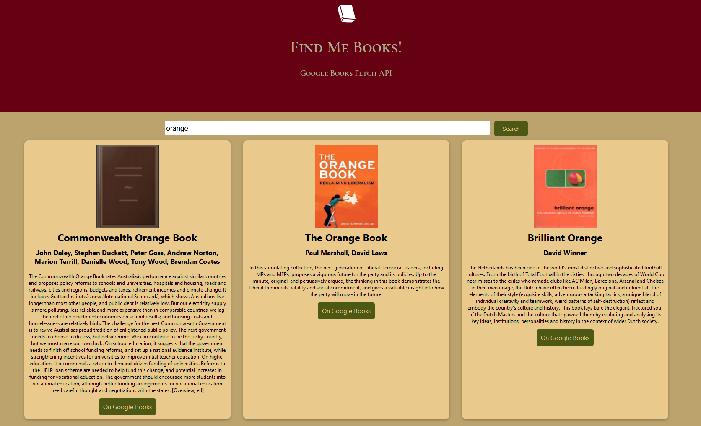

# Google Books API - React

### A React project using the Google Books API to search for books.

This project was created using React as a part of my time at \_nology. The original MVP was to use vanilla JavaScript, but since I wanted to improve my React skills, I asked to complete this project in React instead.

## MVP

The MVP for this project included a number of parameters:

-   A header introducing the project
-   A search bar and a search button
-   When a query is entered into the search bar and the search button is clicked, a maximum of 10 results must be presented on the page.
-   These results must be presented within cards, displaying the title of the book, the author(s), the description and the thumbnail (if available).
-   If no results can be presented, a message should display to the user to indicate no results could be found.
-   It should be responsive on a variety of different screen widths.
-   It should use async await, not .then.
-   It must use BEM and a predefined palette with variables.
-   Use iterators over loops and use pure functions.

**Note: These original parameters were for creating the application in vanilla JS.**

## Graphic Design

In line with my other creations, this project uses a colour palette from Australian flora, in this case a kangaroo paw with sandy yellows, dark greens and deep reds. These colours are defined within the palettes partial and used repeatedly throughout the SCSS.

Similarly, the responsiveness is largely defined based on the devices partial and referenced throughout the SCSS. I decided to remove the description once the screen was a certain narrowness, as otherwise the page was very crowded.

The header font is a font imported from Google Books and I felt that it fit the page purpose, as it reminded me of the font on old books.

## How it Works

The meat of the project currently functions in the BooksContainer container element. Here, the searchBooks async function is defined. When this is called, it gets the books with a predefined query from the API.

SearchBooks then lets the user define the query and creates the search bar and input button, defining the value of input as internal and calling the onChange function on change. The input and the search button are wrapped in a form tag. On submit, the saved value of the input is updated. The useEffect then kicks in and updates the books array using the setBooks function.

Then, within the return, if books is an empty array, a p tag returns to the user saying that no books were found for their query.

If books is not an empty array, the data is mapped into the BookCards. As all the data I needed was inside the volumeInfo object, I set the data to be inherited to be book.volumeInfo. This may need to change when I implement the additional information on click.

Within the BookCards, this data is then imported in several attributes and assigned to various attributes. Edge cases for missing descriptions, authors and images are implemented here.

I have a replacement book cover (the same one used by Google Books) in case the book has no thumbnail assigned.

Authors returns "Author unknown" if no author is found in the book.volumeInfo object.

"No description has been provided." returns if there is no description. I found this happened quite regularly and I wanted feedback for the user in case of these events as I found it quite jarring for them to be missing.

There is also a link to the book on Google Books. This will be replaced with the additional info page. It will potentially be relocated inside that additional info page.

## What I would implement next

Given the time restraints on the project, I was unable to implement everything I would like to into this project. I would like to implement:

-   If a user clicks on a book, for them to be taken to a new page where more details on the book are provided, including the publisher, length, etc. At the moment, I have replaced this with a link that takes the user to the book page on Google Books.
-   A way to continue to incorporate the description, e.g. if it's more than a certain character length, to create a substring and only display the first part of the description with a "...". This would only be implemented after the follow on page with further information would be created.
-   Splitting the application into more pure functions. This is a major project and I will wait until my understanding of React has progressed sufficiently.
-   More integration of new, unique fonts.
-   My favicon is not functioning properly, so I need to fix this.
